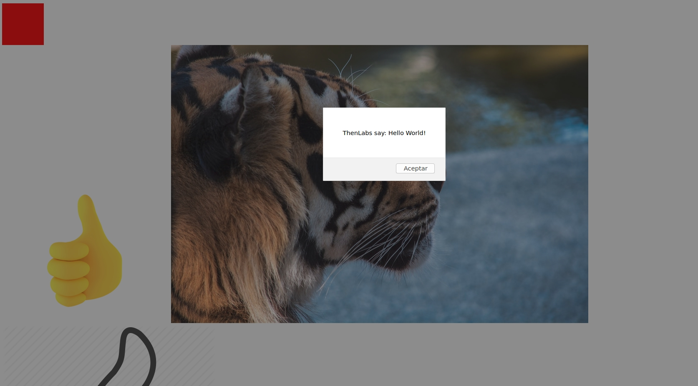
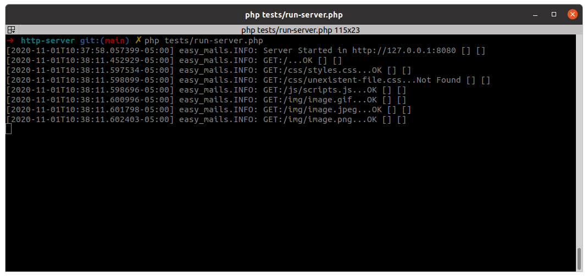

# HttpServer

A [HTTP](https://en.wikipedia.org/wiki/Hypertext_Transfer_Protocol) server written in [PHP](https://en.wikipedia.org/wiki/PHP) with help of the Symfony Components.

## Installation.

    $ composer require thenlabs/http-server

## Usage.

Create a file with the next example content:

>You should change the content according to your needs.

```php
<?php
// run-server.php

require __DIR__.'/vendor/autoload.php';

use ThenLabs\HttpServer\HttpServer;

$config = [
    'host' => '127.0.0.1',
    'port' => 8080,
    'document_root' => __DIR__.'/vendor/thenlabs/http-server/tests/document_root',
];

$server = new HttpServer($config);
$server->start();

while (true) {
    $server->run();
}
```

This file should be executed like that:

    $ php run-server.php

Once does it, we can navigate to the URL and we will see the respectively page.

>In our example, we are serving the `index.html` file which is stored within the `tests/document_root` directory.



### Creating custom routes.

The next example shown the way to creating a custom route.

```php
<?php

use Symfony\Component\Routing\Route;
use Symfony\Component\HttpFoundation\Request;
use Symfony\Component\HttpFoundation\Response;

// ...

$articleRoute = new Route('/article/{id}', [
    '_controller' => function (Request $request, array $parameters) {
        return new Response("This is the article {$parameters['id']}");
    },
]);

$server->addRoute('article', $articleRoute);

// ...
```

### Using the logs.

Like you can will verify, by default are will shows in the console the result of all server requests.



Gracias a que todos los registros son creados con ayuda de la popular librería [Monolog](https://github.com/Seldaek/monolog), es posible personalizar todo el proceso. El siguiente ejemplo muestra como configurar el servidor para que guarde en un archivo todos los registros.

The logs are created with help of the popular [Monolog](https://github.com/Seldaek/monolog) library.

The next example showns a way to put the logs in a file.

```php
<?php

// ...
use Monolog\Handler\StreamHandler;

// ...
$server->getLogger()->pushHandler(new StreamHandler('/path/to/file.logs'));
```

## Development.

### Running the tests.

Start the selenium server.

    $ java -jar path/to/selenium-server-standalone-x.y.z.jar

Start the example inside the tests directory.

    $ php tests/run-server.php

Run PHPUnit.

    $ ./vendor/bin/phpunit